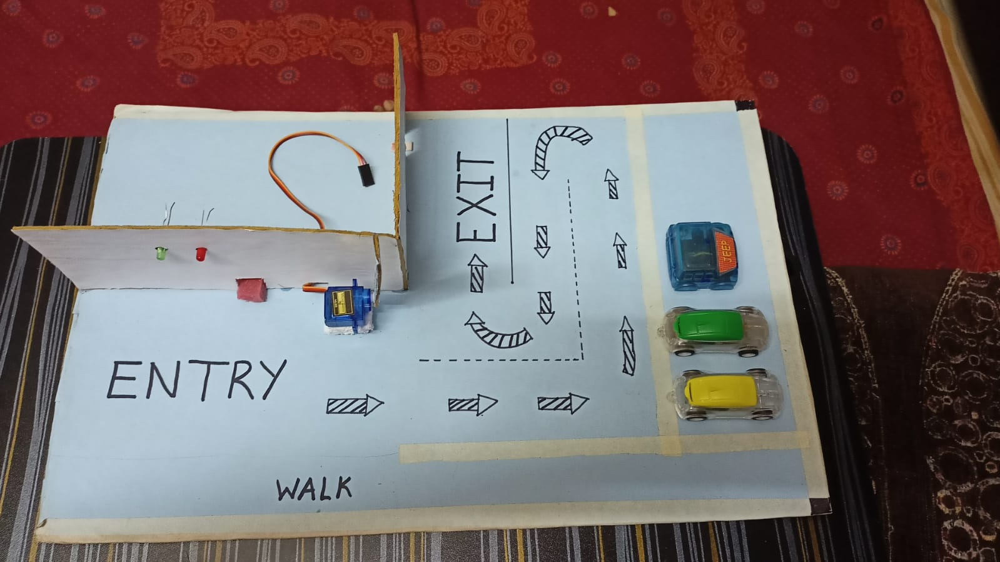

# 🚗 Smart Parking System using Arduino and IoT

A compact and functional Smart Parking System project using Arduino Uno, IR sensors, and a servo motor to manage parking availability and automate entry control.

## 📌 Features
- Automatic gate control using a servo motor
- Vehicle detection using IR sensors
- Real-time slot availability display using LEDs
- Simple physical model and working demo

## 🛠️ Components Used
- Arduino Uno
- 2x IR Sensors (Entry and Exit)
- SG90 Servo Motor
- LEDs (Red & Green)
- Jumper Wires
- Cardboard Model Base

## 🔌 Circuit Diagram

## 🖼️ Model Image

## 🎥 Working Demo
[📽️ Watch Video](working.mp4) *(click to view or download)*

## 🔗 Code
You can find the complete Arduino code [here](https://github.com/vivekpatel-1962/Smart-Parking-System/blob/main/smart_parking_system.ino).

## 🔄 Working Principle

This Smart Parking System is designed to manage a **limited number of parking slots (5 cars)** using IR sensors, LEDs, and a servo motor.

### 🚗 Entry Detection:
- An IR sensor detects when a vehicle enters the parking lot.
- The system increments a counter for each entry.
- If the count reaches **5 (maximum capacity)**:
  - The **servo motor closes the gate** (rotates to 130°).
  - The **green LED turns OFF**, and the **red LED turns ON** to indicate "Parking Full".

### 🚘 Exit Detection:
- Another IR sensor detects when a vehicle exits.
- The counter is decremented for each exit.
- If the count is **less than 5**:
  - The **servo motor opens the gate** (rotates to 25°).
  - The **green LED turns ON**, and the **red LED turns OFF** to indicate "Slots Available".

This creates a fully automatic and real-time controlled parking system.

## 🧠 Future Enhancements
- Display slot availability on an LCD or OLED
- Connect to a cloud platform (e.g., Blynk or Firebase) for remote monitoring
- Add a buzzer or notification alert when parking is full

